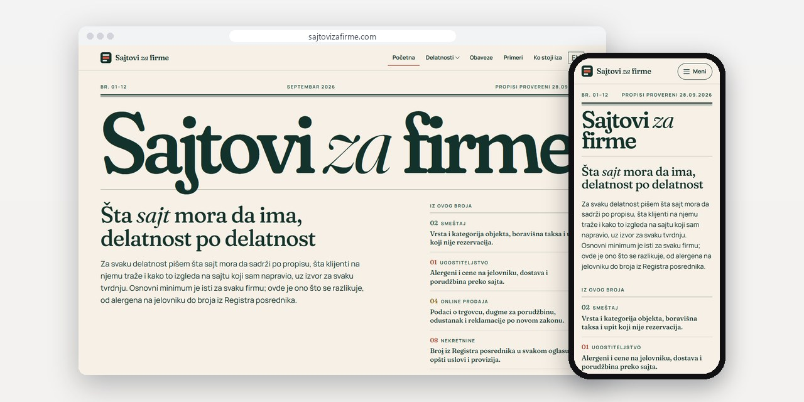
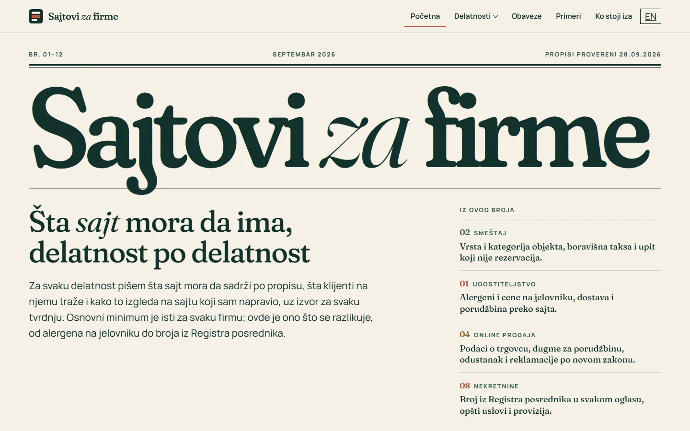
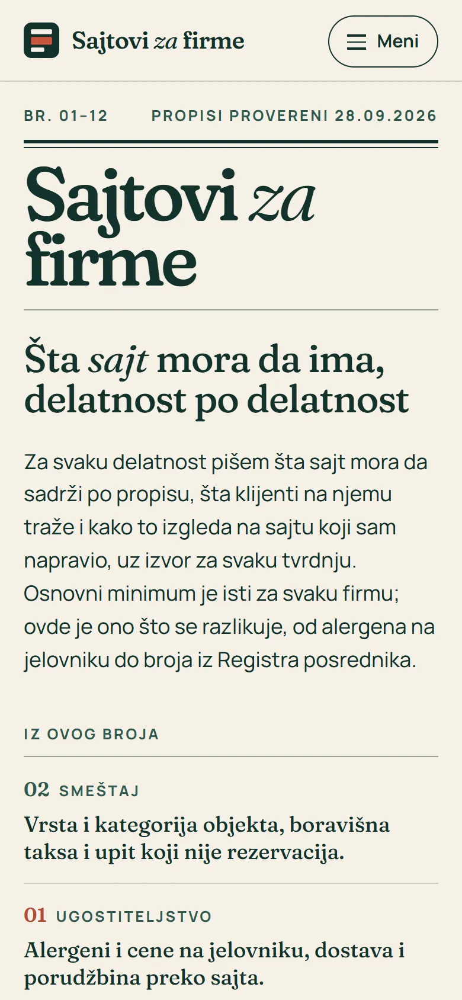
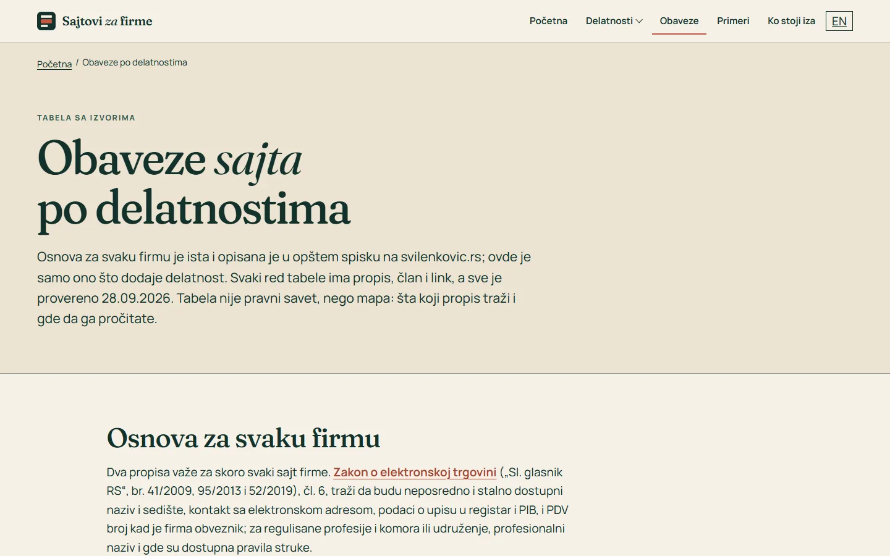

# Sajtovi za firme

Vodič kroz ono što sajt firme mora da ima, delatnost po delatnost, sa svakom zakonskom obavezom vezanom za član propisa.

**[sajtovizafirme.com](https://sajtovizafirme.com/)** · [Studija slučaja](https://svilenkovic.rs/radovi/sajtovi-za-firme) · [English](README.md)

> [!NOTE]
> Moj sopstveni projekat, ne klijentski posao. Izvorni kod je privatan. Ova stranica opisuje šta sajt radi i kako je napravljen.

<table>
  <tr><td><b>Klijent</b></td><td>Sopstveni projekat</td></tr>
  <tr><td><b>Delatnost</b></td><td>Vodič za sajtove firmi po delatnostima</td></tr>
  <tr><td><b>Lokacija</b></td><td>Srbija</td></tr>
  <tr><td><b>Vrsta</b></td><td>Sajt sa više strana</td></tr>
  <tr><td><b>Moj deo posla</b></td><td>Istraživanje, dizajn, izrada, SEO i hosting</td></tr>
  <tr><td><b>Tehnologije</b></td><td>Astro 7, GSAP ScrollTrigger, Lenis, PHP 8.3, SQLite, nginx</td></tr>
</table>

## O projektu

Kad pravim sajt za firmu, uvek se vraćaju ista pitanja: šta restoran mora da napiše o alergenima, sme li ordinacija da objavi rezultate lečenja, koji broj agencija za nekretnine stavlja u oglas. Odgovori postoje, ali su rasuti po zakonima, pravilnicima i kodeksima komora. Skupio sam ih na jedan sajt, složen kao dvanaest izdanja, od restorana i smeštaja do advokata i proizvodnih firmi.

Svaka obaveza ima naziv propisa, broj Službenog glasnika, član i link na tekst. Ono čega u propisu nema označeno je kao praksa, pa se odmah vidi šta mora, a šta je samo dobro rešenje. Svako izdanje počinje anatomijom sajta te delatnosti: na računaru se skica telefona sklapa blok po blok dok spisak prolazi ekranom, a na telefonu je odmah cela.

## Šta sam uradio

- Dvanaest izdanja po delatnostima, svako sa skicom sajta, propisima, čestim greškama i primerom sajta koji sam radio
- Tabela obaveza za sve delatnosti, sa filterom i linkom na propis u svakom redu
- Skica koja se sklapa uz skrol preko GSAP ScrollTrigger-a; Lenis ublažava skrol samo za miš i dodirnu tablu
- Sav tekst je u HTML-u, čita se bez JavaScript-a i ceo je i uz smanjeno kretanje
- Bez kolačića, analitike i zahteva ka tuđim serverima

## Merenja

| | Performanse | Pristupačnost | Dobre prakse | SEO |
| :-- | :-: | :-: | :-: | :-: |
| Telefon | 92 | 100 | 100 | 100 |
| Desktop | 100 | 100 | 100 | 100 |

PageSpeed Insights, laboratorijsko merenje živog sajta, oktobar 2026. Sigurnosna zaglavlja: 6 od 6. axe provera pristupačnosti: bez prekršaja. Strukturisani podaci: `FAQPage`, `Person`.

## Snimci ekrana

<table>
  <tr>
    <td width="68%" valign="top"></td>
    <td width="32%" valign="top"></td>
  </tr>
</table>

Tabela obaveza, svaki red sa propisom i članom

---

Izrada: [D. Svilenković](https://svilenkovic.rs).
